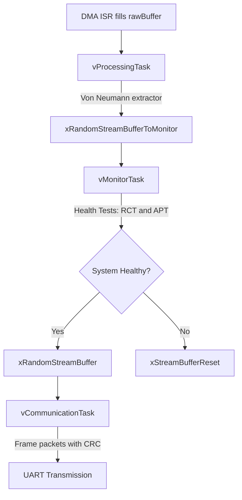

# Embedded Real-Time System for Quantum Entropy Processing

This project implements a high-speed pipeline for generating cryptographically secure random numbers. It captures raw quantum noise via DMA, processes it through a von Neumann extractor, monitors system health based on NIST standards, and transmits secured data packets over UART.

---

## 🚀 Overview

The system is designed to:
- Capture raw quantum noise.
- Process the noise into cryptographically secure random numbers.
- Monitor system health in real-time.
- Transmit secured data packets over UART.

---

## 🏗 Architecture

The system is divided into four main stages:

1. **Ingestion**: 
   - DMA captures raw entropy into a double-buffer.

2. **Processing**: 
   - `vProcessingTask` applies von Neumann de-biasing and packs bits into bytes.

3. **Monitoring (Health Tests)**: 
   - `vMonitorTask` acts as a gatekeeper, performing:
     - **RCT (Repetition Count Test)**.
     - **APT (Adaptive Proportion Test)** using Brian Kernighan’s algorithm for fast popcount.

4. **Communication**: 
   - `vCommunicationTask` frames data into packets with a header and a CRC8 checksum (optimized via a Lookup Table).

---

## 🛠 Key Features

- **Performance**: 
  - Zero-copy data handling with FreeRTOS Stream Buffers.
  
- **Security**: 
  - Real-time health monitoring to detect hardware failure or entropy collapse.
  
- **Optimization**: 
  - Bitwise operations for bit-packing and $O(k)$ bit-counting ($k$ = number of set bits).
  
- **Reliability**: 
  - CRC8-ATM error detection for serial communication.

---

## 📊 System Flow



---

## 📂 Project Structure

- **`src/`**: Core logic
  - `processing.c`, `monitor.c`, `communication.c`, `crc.c`, `hardware_uart.c`, `main.c`.

- **`include/`**: Protocol definitions and task prototypes.

- **`drivers/`**: Hardware-specific code (UART/DMA stubs).

- **`Makefile`**: Build system configuration.

```
QRNG-System/
├── src/                   # logic implementation (C files)
│   ├── main.c             # System initialization and task launching
│   ├── processing.c       # Von Neumann algorithm and entropy processing
│   ├── monitor.c          # Health tests (RCT, APT)
│   ├── communication.c    # Packet construction and protocol management
│   └── crc.c              # CRC8 calculation (including Lookup Table)
├── drivers/               # Hardware-specific code (UART/DMA stubs)
│   └── hardware_uart.c    # UART driver (hardware layer)
├── include/               # Definitions and interfaces (Header files)
│   ├── protocol.h         # Packet structure and protocol definitions
│   └── qrng_tasks.h       # Task function declarations
├── scripts/               # Host-side code (Python)
│   └── host_receiver.py   # Serial data reception and verification
│   └── stats_analysis.py  # Data visualization and statistical analysis
│   └── test_serial.py     # Serial connection testing script
├── docs/                  # Documentation and explanations
│   ├── ReadMe.md          # General project explanation and running instructions
│   ├── Physics.md         # Mathematical formalism of Single Photon attitude & Zener noise and tunneling
│   ├── Statistics.md      # Statistical analysis and results
│   └── Simulation.md      # Simulation setup and instructions
├── .gitignore             # Files like .o files to ignore in git
├── requirements.txt       # Python dependencies for host receiver script
├── Makefile               # Build instructions for the system (Linux/macOS/WSL)
├── manage.ps1             # Build instructions for the system (Windows PowerShell)
├── diagram.json           # Set up file for Wokwi simulation
├── wokwi_version.ino      # A copy paste version file for Wokwi simulation
└── wokwi.toml             # A configuration file for Wokwi simulation
```
> [!NOTE]
> You can simulate this project on Wokwi by copying the contents of `wokwi_version.ino` into a new Wokwi ESP32 project and running it.
> [[Wokwi ESP32 simulator](https://wokwi.com/projects/new/esp-idf-esp32)]
> Further information about the simulation can be found in the `docs/Simulation.md` file.

---

## ▶️ Usage

### Prerequisites

Install Python dependencies:
```bash
pip install -r requirements.txt
```

Essential packages include:
- pyserial (serial communication)
- numpy (numerical operations)
- scipy (statistical analysis)
- pyqtgraph (data visualization)
- matplotlib (statistical plotting)

---

### 🖥️ Native Build (Local Hardware)

> [!NOTE]
> Building natively generates the `qrng_system_logic` executable. This is used strictly for fast, local unit testing of the core C logic (like the CRC and von Neumann algorithms) without needing the ESP32 hardware simulator. **It is not used during the Wokwi simulation.**

#### Linux / macOS:
```bash
# Build the project
make

# Run the executable
./qrng_system_logic

# Receive and visualize data
python3 scripts/host_receiver.py

# Clean build artifacts and Python cache
make clean
```

#### Windows (PowerShell):
```powershell
# Build the project (use WSL or MinGW)
make

# Run the executable
.\qrng_system_logic.exe

# Receive and visualize data
python scripts/host_receiver.py

# Clean build artifacts and Python cache
.\manage.ps1 clean
```

> [!TIP]
> `host_receiver.py` can take an optional CLI argument `--save-binary` to save received entropy to `quantum_entropy.bin` for further analysis.
> In all the automated simulation setups, this flag is disabled by default.

---

### 🎮 Wokwi Simulation

For simulating the system without physical hardware, use the appropriate command for your platform:

#### Linux / macOS:

```bash
make sim # Get instructions how to start Wokwi simulation (vs code extension required)
make gui # Run visualizer
make clean # Clean artifacts
make help # Show help menu
```

#### Windows (PowerShell):

```powershell
.\manage.ps1 sim    # Show simulation instructions
.\manage.ps1 gui    # Run visualizer
.\manage.ps1 clean  # Clean artifacts
.\manage.ps1 help   # Show help menu
```
>[!NOTE]
> `.\manage.ps1` by default runs the build process (compiles native logic). To run the python visualizer assuming the Wokwi simulation is active and listening on port 4000, specify the `gui` target.

---

> [!TIP]
> For detailed simulation setup instructions (web-based and VS Code), see [Simulation.md](Simulation.md)

---

This project is built with **FreeRTOS** and optimized for embedded real-time systems.