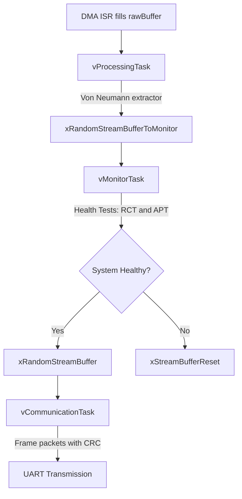

# Embedded Real-Time System for Quantum Entropy Processing

This project implements a high-speed pipeline for generating cryptographically secure random numbers. It captures raw quantum noise via DMA, processes it through a von Neumann extractor, monitors system health based on NIST standards, and transmits secured data packets over UART.

---

## 🚀 Overview

The system is designed to:
- Capture raw quantum noise.
- Process the noise into cryptographically secure random numbers.
- Monitor system health in real-time.
- Transmit secured data packets over UART.

---

## 🏗 Architecture

The system is divided into four main stages:

1. **Ingestion**: 
   - DMA captures raw entropy into a double-buffer.

2. **Processing**: 
   - `vProcessingTask` applies von Neumann de-biasing and packs bits into bytes.

3. **Monitoring (Health Tests)**: 
   - `vMonitorTask` acts as a gatekeeper, performing:
     - **RCT (Repetition Count Test)**.
     - **APT (Adaptive Proportion Test)** using Brian Kernighan’s algorithm for fast popcount.

4. **Communication**: 
   - `vCommunicationTask` frames data into packets with a header and a CRC8 checksum (optimized via a Lookup Table).

---

## 🛠 Key Features

- **Performance**: 
  - Zero-copy data handling with FreeRTOS Stream Buffers.
  
- **Security**: 
  - Real-time health monitoring to detect hardware failure or entropy collapse.
  
- **Optimization**: 
  - Bitwise operations for bit-packing and $O(k)$ bit-counting ($k$ = number of set bits).
  
- **Reliability**: 
  - CRC8-ATM error detection for serial communication.

---

## 📊 System Flow



---

## 📂 Project Structure

- **`src/`**: Core logic
  - `processing.c`, `monitor.c`, `communication.c`, `crc.c`, `hardware_uart.c`, `main.c`.

- **`include/`**: Protocol definitions and task prototypes.

- **`drivers/`**: Hardware-specific code (UART/DMA stubs).

- **`Makefile`**: Build system configuration.

```
QRNG-System/
├── src/                   # logic implementation (C files)
│   ├── main.c             # System initialization and task launching
│   ├── processing.c       # Von Neumann algorithm and entropy processing
│   ├── monitor.c          # Health tests (RCT, APT)
│   ├── communication.c    # Packet construction and protocol management
│   └── crc.c              # CRC8 calculation (including Lookup Table)
├── drivers/               # Hardware-specific code (UART/DMA stubs)
│   └── hardware_uart.c    # UART driver (hardware layer)
├── include/               # Definitions and interfaces (Header files)
│   ├── protocol.h         # Packet structure and protocol definitions
│   └── qrng_tasks.h       # Task function declarations
├── scripts/               # Host-side code (Python)
│   └── host_receiver.py   # Serial data reception and verification
│   └── stats_analysis.py  # Data visualization and statistical analysis
├── docs/                  # Documentation and explanations
│   ├── ReadMe.md          # General project explanation and running instructions
│   └── Physics.md         # Mathematical formalism of Single Photon attitude & Zener noise and tunneling
│   └── Statistics.md      # Statistical analysis and results
├── Makefile               # Build instructions for the system
├── requirements.txt       # Python dependencies for host receiver script
├── .gitignore             # Files like .o files to ignore in git
└── wokwi_version.c        # A copy paste version file for Wokwi simulation
```
> [!NOTE]
> [[Wokwi ESP32 simulator](https://wokwi.com/projects/new/esp-idf-esp32)]
> You can simulate this project on Wokwi by copying the contents of `wokwi_version.c` into a new Wokwi ESP32 project.

---

## ▶️ Usage

To build and run the project, follow these steps:

1. **Build the Project**:
   - Open a terminal in the project root directory.
   - Run the following command:
     ```bash
     make
     ```
   - Install python dependencies:
     ```bash
     pip install -r requirements.txt
     ```
     Essential packages include: 
        - pyserial
        - numpy
        - scipy
        - matplotlib

2. **Run the Executable**:
   - After building, the executable `qrng_system` will be generated in the project root.
   - Run the executable with:
     ```bash
     ./qrng_system
     ```

3. **Host Receiver**:
   - To receive and analyze the data on the host side, ensure you have Python installed along with the required packages listed in `requirements.txt`.
   - Run the host receiver script:
     ```bash
     python scripts/host_reciever.py <port> <baudrate>
     ```
   - Adjust `<port>` and `<baudrate>` as necessary for your setup, default is `COM1` and `115200`.

4. **Clean the Build**:
   - To remove all object files and the executable, run:
     ```bash
     make clean
     ```

---

This project is built with **FreeRTOS** and optimized for embedded real-time systems.