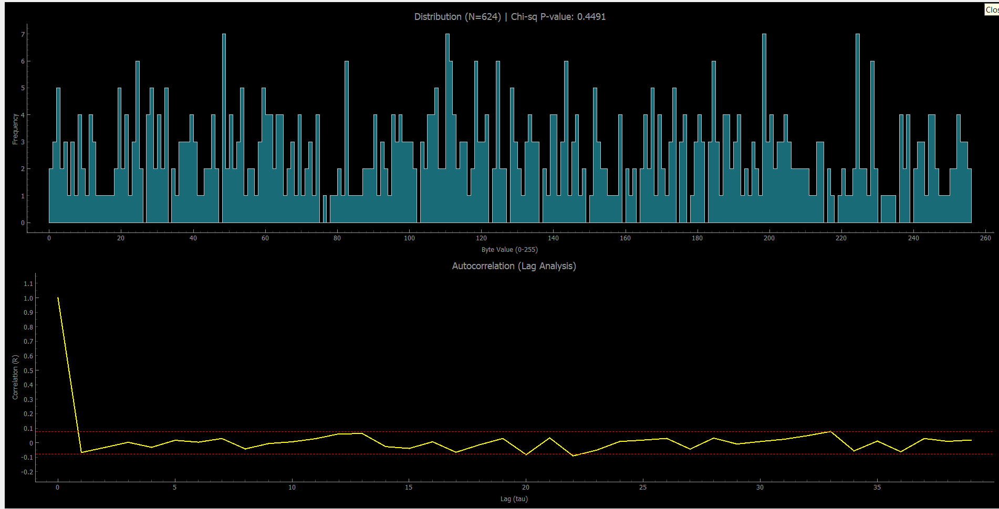

# Wokwi Simulation Guide

This guide explains how to simulate the QRNG system using Wokwi, both in the web browser and locally in VS Code.

---

## 🌐 Web-Based Simulation

To run the simulation in your browser:

1. **Navigate to Wokwi ESP32 Simulator**:
   - Open [Wokwi ESP32 Simulator](https://wokwi.com/projects/new/esp-idf-esp32) in your browser.

2. **Copy the Simulation Code**:
   - Copy the entire contents of [wokwi_version.ino](../wokwi_version.ino) from this project.
   - Paste it into the Wokwi editor.

3. **Configure Output for Web Viewing** (Optional):
   - To see debug output in the web console:
     - **Uncomment** the `printf` lines inside the UART function `hardware_uart_send`.
     - **Comment out** the `Serial.write` line.
   - This allows you to view serial output directly in the browser's serial monitor.

4. **Run the Simulation**:
   - Click the **"Start Simulation"** button in Wokwi.
   - Observe the output in the serial monitor.

---

## 💻 Local Simulation in VS Code

For a more integrated development experience, you can run the simulation locally in VS Code.

### Prerequisites

1. **Install Wokwi Extension**:
   - Open VS Code.
   - Go to the Extensions view (Ctrl+Shift+X).
   - Search for "Wokwi Simulator" and install it.

2. **Get a Free License**:
   - Visit [Wokwi License Page](https://wokwi.com/vscode) to obtain a free license.
   - Follow the instructions to activate the extension.

### Setup Steps

1. **Compile Firmware in Wokwi Web**:
   - Open your project in [Wokwi ESP32 Simulator](https://wokwi.com/projects/new/esp-idf-esp32).
   - Paste the contents of [wokwi_version.ino](../wokwi_version.ino).
   - Click **"Start Simulation"** to compile the firmware.

2. **Download Compiled Firmware**:
   - Press **F1** to open the Command Palette.
   - Type and select **"Download Compiled Firmware"**.
   - Save the binary file with the name `qrng-firmware-esp32.bin` in the project root directory.

3. **Configure wokwi.toml**:
   - Open [wokwi.toml](../wokwi.toml) in the project root.
   - Ensure the `firmware` field points to the downloaded binary file name:
     ```toml
     [wokwi]
     version = 1
     firmware = "qrng-firmware-esp32.bin"
     rfc2217ServerPort = 4000
     ```

4. **Run the Local Simulation**:
   - Open [diagram.json](../diagram.json) in VS Code.
   - Click the **"Start Simulation"** button that appears in the editor, or press **F1** and select **"Wokwi: Start Simulator"**.

---

## 🔌 Connecting to the Simulation

### Receive Data with Host Receiver

Once the simulation is running, you can receive and analyze the data:

```bash
python scripts/host_receiver.py
```

- The wokwi extension transfer the serial data over a virtual  port using RFC2217 protocol (port 4000).
- The default baud rate is 115200.

### Test Serial Connection

To verify the serial connection is working correctly:

```bash
python scripts/test_serial.py
```

This script tests the serial communication and validates the connection to the Wokwi simulation.

---

## 📸 Example

Below is an example of the Wokwi simulation running locally in VS Code:



---

## 🛠 Troubleshooting

- **Firmware not loading**: Ensure the `firmware` field in `wokwi.toml` matches the downloaded binary filename exactly.
- **Serial port not found**: Check that the Wokwi simulation is running and note the virtual serial port assigned.
- **Compilation errors in web**: Verify that the entire contents of `wokwi_version.ino` were copied without modifications.

---

## 📚 Additional Resources

- [Wokwi Documentation](https://docs.wokwi.com/)
- [Wokwi VS Code Extension Guide](https://docs.wokwi.com/vscode/getting-started)
- [ESP32 Reference](https://docs.espressif.com/projects/esp-idf/en/latest/esp32/)
- [wokwi CLI](https://github.com/wokwi/wokwi-cli) (for CI usage)